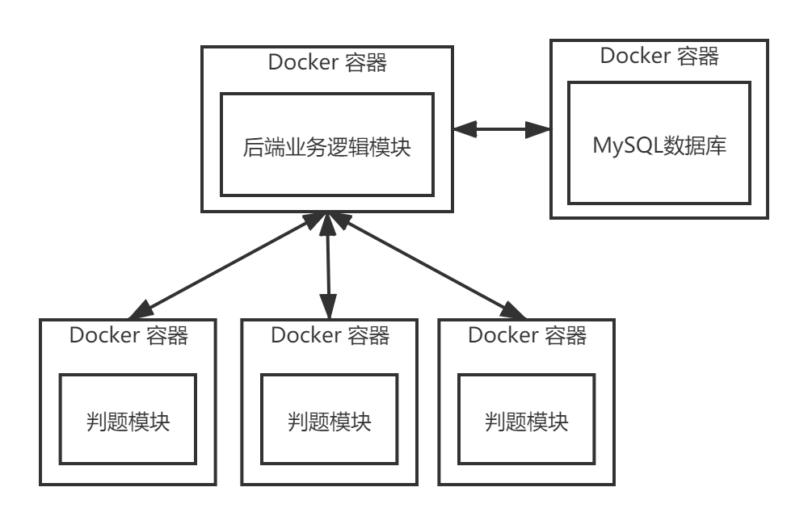
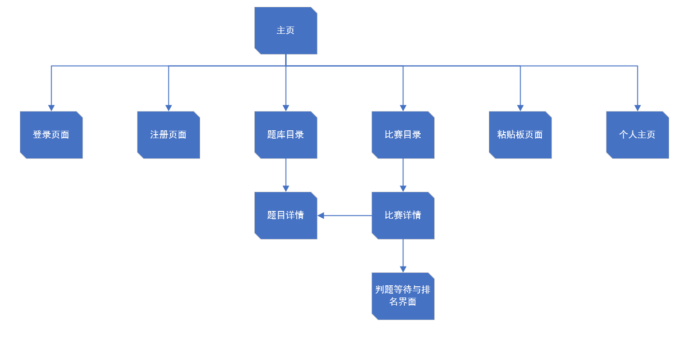
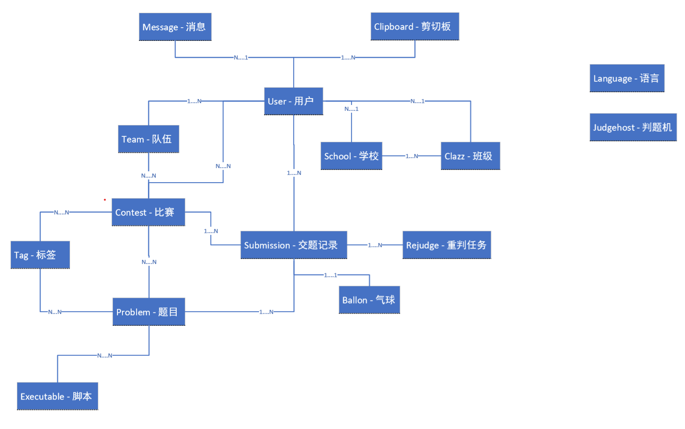

# Code Learning Platform 编程学习平台

## Definition 定义

CLP（Code Learning Platform）是一个基于ICPC思想的在线学习编程语言、算法、数据结构的平台。

CLP不仅可以应用于例如ICPC类的编程比赛，还可用于高校编程实验课和考试、个人编程能力提高练习、企业招聘笔试等领域。

CLP实现了一套以ICPC赛制为基础的编程比赛系统。竞赛组织者在网站上编写题目并组织成比赛，比赛组织者可设置比赛题目、开始和结束时间、参与排名的用户以及其他比赛相关信息。参加比赛的用户通过提交比赛内编程题的解答代码来作答，后台将会编译运行这段代码并使用比赛组织者预先设定好的、用于判断题目对错的输入输出对程序正确性进行判断，平台最终将会反馈用户提交代码的正误并影响该名用户的比赛排名。以最多解答正确题目、最短题目运行时间、最早提交解答由前到后优先级递减的方式决定用户的排名。

CLP基于上述编程比赛系统，扩展出了高校编程实验课和考试与企业招聘笔试系统，并提供题目分值评价体系，比赛组织者可以为难度不同的题目设置不同的权重值，从而以个性化的方式对学习或参赛者进行排名。

CLP组织者会不定期向平台添加公共的编程语言、算法、数据结构题目以便个人进行练习或比赛组织者从公共题库里选取题目进行比赛，同时鼓励比赛组织者在比赛结束后将题目公开。

## Function 功能

### System Overview 系统概述

CLP系统主要分为以下几个核心系统

* 基于Online Judge思想的在线评测系统
* 在线聊天对话答疑系统
* 在线直播与在线网课系统

基于Online Judge思想的在线评测系统，实现在线提交程序源代码，系统对源代码进行编译和执行，并通过预先设计的测试数据来检验程序源代码的正确性。同时实现ICPC赛制比赛举办功能，后台管理功能。并提前预留好允许教师注册管理队伍与管理班级成员的设计。

在线聊天对话答疑系统允许系统用户向比赛组织者、教师、系统管理员发送信息，可以用于课下问题解答、ICPC比赛提出Clarifications、考试过程中学生与老师进行沟通等场景。

在线直播与在线网课系统，规划中，优先级别低。

### 基于Online Judge思想的在线评测系统

#### Overview 概述

在线评测系统分为以下模块

* 前端模块
* 数据库模块
* 后端业务逻辑模块
* 安全模块
* 判题模块

模块之间关系如下图所示

#### Front-end 前端模块

使用技术：

* 前端框架：Vue、Vuex、Vue Router
* 命令行工具：Vue CLI
* 前端UI框架：ElementUI

#### Database 数据库模块

使用技术：MariaDB、Docker

数据库模块通过MariaDB的官方Docker镜像进行部署，业务生产环境时先行启动，核心业务逻辑启动时由ORM框架对数据库进行初始化

#### Service 核心业务逻辑

主体功能参考高校Online Judge平台，实现用户可打开网站浏览题目、比赛/作业列表、提交题目解答、系统调用判题机并反馈用户判题结果

#### Security 安全模块

使用Spring Security做JWT第一方登录与OAuth2的第三方登录（最后实现）

#### Judger 判题模块

使用Java语言编写的多线程分布式判题机，使用RESTful API形式实现判题机与主服务器的互联。

## Design 设计

### 前端

#### 页面跳转逻辑

### 后端

#### 数据库设计

